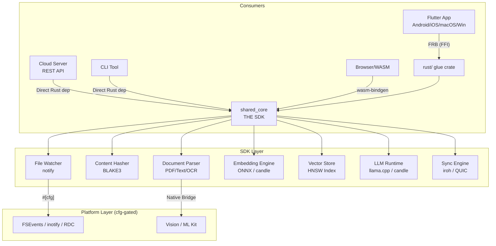
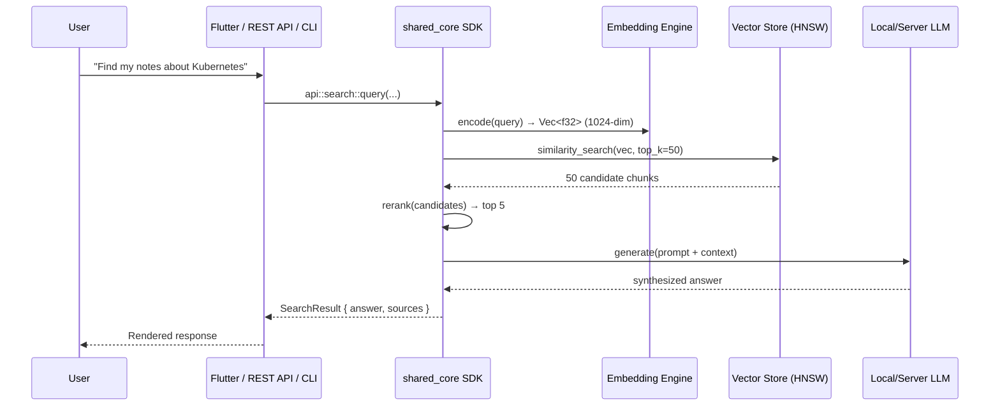
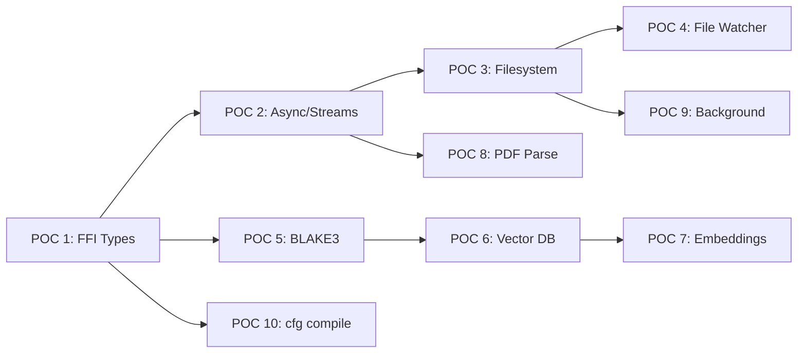

# CrossPlatformIndexer — Architecture, Roadmap & POC Plan

A local-first, multimodal RAG solution for Android, iOS, macOS, Windows, **and cloud servers**. Architecture follows the **"Shared Brain, Native Face"** pattern: a Rust core handles all heavy processing, platform adapters (Flutter, CLI, REST API, WASM) provide the interface.

---

## System Architecture

### 3-Layer Model

> [!IMPORTANT]
> `shared_core` is a **pure Rust SDK** with zero platform dependencies. It can be consumed by Flutter (via FFI), by a cloud server (as a Rust crate or C library), by a CLI tool, or compiled to WASM for browser use.



### SDK Design Principles

Since `shared_core` must work everywhere — mobile, desktop, cloud, and WASM — it follows these rules:

| Rule | Why |
|------|-----|
| **No Flutter/FRB dependency** | FRB annotations live in the `rust/` glue crate, not in `shared_core` |
| **No hardcoded paths** | All I/O goes through trait abstractions (e.g., `trait Storage`) |
| **Async-first via `tokio`** | Works on cloud (tokio runtime), mobile (FRB async bridge), and WASM (wasm-compatible executor) |
| **Feature flags for heavy deps** | `features = ["llm", "ocr", "sync"]` so cloud can skip mobile-only code and vice versa |
| **`no_std` compatible core math** | Vector math / hashing can compile to WASM without `std` |

```toml
# shared_core/Cargo.toml (target state)
[features]
default = ["watcher", "embedding", "vectordb"]
watcher = ["notify"]          # Skip on WASM/cloud-without-fs
embedding = ["ort"]           # Skip if using external embedding API
llm = ["llama-cpp-rs"]        # Heavy; optional
sync = ["iroh"]               # P2P; skip on cloud
ocr-native = []               # Enables platform OCR bridges
```

### Folder Structure (Target State)

```
CrossPlatformIndexer/
├── Cargo.toml                          # Workspace root
├── shared_core/                        # THE SDK — all platform-agnostic logic
│   ├── Cargo.toml                      # Feature-gated dependencies
│   └── src/
│       ├── lib.rs
│       ├── api/                        # Public SDK surface
│       │   ├── mod.rs
│       │   ├── indexer.rs              # File ingestion & indexing
│       │   ├── search.rs              # RAG query pipeline
│       │   ├── sync.rs                # P2P sync control
│       │   └── config.rs             # Settings & preferences
│       ├── ingestion/                  # File parsing & chunking
│       │   ├── pdf.rs, text.rs, image.rs, video.rs
│       ├── embedding/                  # Vector generation (ONNX/candle)
│       ├── vectordb/                   # Embedded vector store + HNSW
│       ├── llm/                        # On-device/server inference
│       ├── watcher/                    # Filesystem monitoring (cfg-gated)
│       ├── sync/                       # P2P sync (iroh, HLC)
│       ├── storage/                    # Trait-based storage abstraction
│       │   ├── mod.rs                  # trait Storage { ... }
│       │   ├── fs.rs                   # Local filesystem impl
│       │   └── memory.rs              # In-memory impl (for tests/WASM)
│       └── hasher.rs                   # BLAKE3 content addressing
├── apps/
│   ├── flutter_app/                    # Mobile/Desktop Flutter UI
│   │   ├── rust/                       # FRB glue crate (#[frb] wrappers)
│   │   ├── rust_builder/              # Cargokit build plugin (don't touch)
│   │   └── lib/                       # Flutter/Dart UI
│   ├── server/                         # Cloud REST API (future)
│   │   ├── Cargo.toml                 # depends on shared_core
│   │   └── src/main.rs               # axum/actix web server
│   └── cli/                           # CLI tool (future)
│       ├── Cargo.toml
│       └── src/main.rs               # clap-based CLI
├── docs/                              # Project documentation
│   └── architecture.md               # This file
└── tools/                             # Benchmarks, test harnesses
```

### Data Flow: Query Pipeline



### Content Addressing (BLAKE3)

Every file is identified by its content hash, not its path:

```
FileIdentity {
    content_hash: BLAKE3(file_bytes),      // Primary key
    size_bytes: u64,
    mime_type: String,
    sources: Vec<DevicePath>,              // Where it lives on each device/server
    last_modified: HLC timestamp,
}
```

Benefits: deduplication, integrity checking, sync efficiency (only transfer missing hashes).

---

## Development Roadmap

### Phase 0: Foundation POC ← *YOU ARE HERE*
**Goal**: Validate cross-platform architecture works end-to-end.
**Duration**: 2–3 weeks

| POC # | What to Validate | Platforms |
|-------|-----------------|-----------|
| 1 | FFI Bridge — complex types (structs, enums, Result, Vec) | macOS + Android |
| 2 | Async + Streams — progress reporting, cancellation | macOS + Android |
| 3 | Filesystem access — read from platform directories | All 4 + server |
| 4 | File watching — `notify` crate on each OS | macOS + Windows |
| 5 | BLAKE3 hashing — performance, cross-platform determinism | All + WASM |
| 6 | Embedded Vector DB — 100K vector insert/search/persist | macOS + Android |
| 7 | On-device embeddings — ONNX model load + inference | macOS + Android |
| 8 | PDF parsing — pure Rust text extraction | All |
| 9 | Background execution — Android WorkManager, iOS BGTask | Android + iOS |
| 10 | Conditional compilation — `#[cfg]` + cross-compile | All targets |

### Phase 1: Shared Logic Foundation (3–4 weeks)
- `shared_core::watcher` — filesystem monitoring
- `shared_core::hasher` — BLAKE3 content hashing
- `shared_core::vectordb` — embedded vector store + HNSW
- `shared_core::storage` — trait abstraction for local/cloud/memory backends
- Flutter UI: file browser, indexing progress

### Phase 2: Document Ingestion (3–4 weeks)
- PDF → Markdown extraction (`lopdf` + `pdf-extract`)
- Semantic chunking with sentence-windowing
- Native OCR bridge (Vision/ML Kit) via platform channels
- Flutter UI: document preview with chunks

### Phase 3: Embedding & Search (4–5 weeks)
- ONNX model loader via `ort` crate
- Batch embedding pipeline with progress
- Cosine similarity + HNSW search
- Retrieve-then-Rerank pipeline (top-50 → cross-encoder → top-5)
- Flutter UI: search bar, results with scores

### Phase 4: On-Device LLM (3–4 weeks)
- Quantized SLM via `llama-cpp-rs` (Gemma-3-1B / Llama-3.2-1B)
- Streaming token generation → Flutter
- Prompt templates with context injection
- Flutter UI: chat with streaming + source attribution

### Phase 5: Multimodal Pipeline (4–5 weeks)
- Image embeddings (CLIP/SigLIP)
- Audio transcription (`whisper-rs`)
- Video keyframe extraction
- Unified multimodal vector space

### Phase 6: P2P Sync + Cloud SDK (4–5 weeks)
- Iroh-based P2P with QUIC + NAT traversal
- HLC-ordered conflict-free metadata sync
- `apps/server/` — REST API wrapping `shared_core`
- Cloud deployment: `shared_core` as a server-side SDK
- Docker image for self-hosted cloud indexing

---

## POC Test Plan — Detailed

> [!IMPORTANT]
> Each POC must pass on **macOS + at least one mobile platform** before Phase 1.

### POC 1: FFI Bridge — Complex Types

```rust
// shared_core/src/api/
pub struct FileInfo {
    pub name: String,
    pub size: u64,
    pub tags: Vec<String>,
    pub metadata: HashMap<String, String>,
}

pub enum IndexStatus {
    Pending,
    Processing { progress: f32 },
    Complete { chunks: u32 },
    Error { message: String },
}

pub fn parse_file(path: String) -> Result<FileInfo, String>;
```

- [ ] Struct with nested types roundtrips correctly
- [ ] Enum variants with data serialize/deserialize
- [ ] `Result::Err` → Dart exception
- [ ] Large `Vec<u8>` (10MB+) without excessive copy
- [ ] Also callable as a plain Rust function (no FRB) for server use

### POC 2: Async + Streams

```rust
pub async fn hash_large_file(path: String) -> String;
pub fn index_directory(path: String) -> impl Stream<Item = IndexProgress>;
```

- [ ] Async doesn't block Flutter UI (verify with spinning animation)
- [ ] Stream → Flutter progress bar with live updates
- [ ] Cancellation: dropping Dart subscription cancels Rust task
- [ ] Error mid-stream propagates to Dart

### POC 3: Filesystem Access

```rust
pub fn list_documents(dir: String) -> Vec<FileEntry>;
pub fn read_file_bytes(path: String) -> Vec<u8>;
```

- [ ] macOS: `~/Documents`, `~/Downloads`
- [ ] Android: scoped storage
- [ ] iOS: app sandbox
- [ ] Windows: `C:\Users\<user>\Documents`
- [ ] Server: arbitrary paths (Linux)
- [ ] Permission denied → error, not crash

### POC 4: File Watching

```rust
pub fn watch_directory(path: String) -> impl Stream<Item = FileEvent>;
```

- [ ] macOS FSEvents, Windows RDC, Android inotify
- [ ] iOS limitations documented
- [ ] Debouncing rapid changes
- [ ] No file handle / memory leaks over hours

### POC 5: BLAKE3 Hashing

```rust
pub fn hash_file(path: String) -> String;
pub async fn hash_file_streaming(path: String) -> String; // large files
```

- [ ] Correct hash (verify vs `b3sum`)
- [ ] Streaming for >1GB without high memory
- [ ] Desktop >1GB/s, Mobile >200MB/s
- [ ] Same file → same hash across all platforms

### POC 6: Embedded Vector Database

```rust
pub fn create_index(dimension: u32) -> IndexHandle;
pub fn insert_vector(index: IndexHandle, id: String, vector: Vec<f32>);
pub fn search(index: IndexHandle, query: Vec<f32>, top_k: u32) -> Vec<SearchResult>;
```

- [ ] Insert + search 100K vectors (1024-dim)
- [ ] Search latency <50ms on mobile
- [ ] Persist to disk, reopen, search still works
- [ ] Thread-safe concurrent reads during writes

### POC 7: On-Device Embeddings

```rust
pub fn load_embedding_model(path: String) -> ModelHandle;
pub fn embed_text(model: ModelHandle, text: String) -> Vec<f32>;
```

- [ ] Load quantized ONNX model (~30MB)
- [ ] "dog" closer to "puppy" than "car" (cosine sim)
- [ ] Batch 100 texts: measure latency + memory
- [ ] Works on Metal (macOS), NNAPI (Android), CoreML (iOS)

### POC 8: PDF Parsing

```rust
pub fn extract_pdf_text(path: String) -> Vec<PageContent>;
pub fn chunk_text(text: String, chunk_size: u32, overlap: u32) -> Vec<TextChunk>;
```

- [ ] Multi-page PDF with mixed layouts
- [ ] Scanned PDFs → empty text (no crash)
- [ ] Unicode (CJK, Devanagari) correct
- [ ] 500+ page PDF doesn't OOM on mobile

### POC 9: Background Execution

- [ ] Android WorkManager calls Rust FFI
- [ ] iOS BGProcessingTask within ~30s budget
- [ ] Desktop: thread pool continues when minimized
- [ ] State persists across app kill/resume

### POC 10: Conditional Compilation

```rust
pub fn get_platform_info() -> PlatformInfo;

#[cfg(target_os = "macos")]
fn platform_specific() { /* ... */ }
```

- [ ] Correct OS/arch reported on each platform
- [ ] Cross-compile: `cargo build --target aarch64-linux-android`
- [ ] Platform deps gated with `[target.'cfg(...)'.dependencies]`
- [ ] Server target (x86_64-unknown-linux-gnu) compiles without mobile deps

---

## POC Execution Order



**Critical path**: POC 1 → 2 → 3 → 4 (validates FFI + platform story)
**Parallel**: POC 5, 6, 7 once POC 1 passes

---

## Key Technical Decisions

> [!WARNING]
> Decide before Phase 1. These affect the entire codebase.

| Decision | Options | Recommendation |
|----------|---------|----------------|
| **Vector DB** | usearch / qdrant-embedded / sqlite-vss | `usearch` — tiny, proven HNSW, works on mobile + server |
| **Embedding** | `ort` (ONNX) / `candle` (pure Rust) | `ort` first (HW-accelerated), `candle` as fallback / WASM |
| **LLM** | `llama-cpp-rs` / `candle` / ExecuTorch | `llama-cpp-rs` — Metal/CUDA, quantization, battle-tested |
| **PDF** | `lopdf`+`pdf-extract` / `pdfium` bindings | `lopdf` — pure Rust, no native deps, works everywhere |
| **Structured DB** | `redb` / `rusqlite` / `sled` | `redb` — pure Rust, ACID, no C deps |
| **P2P** | `iroh` / `libp2p` / custom QUIC | `iroh` — excellent NAT traversal, simpler than libp2p |
| **Server framework** | `axum` / `actix-web` | `axum` — tokio ecosystem, clean API |
