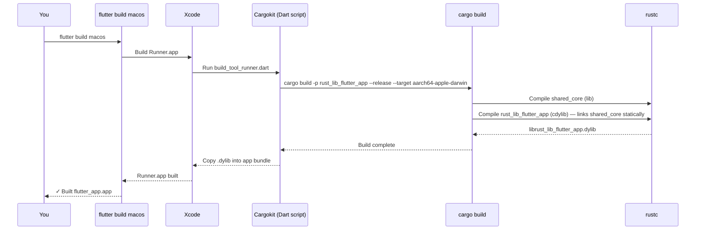
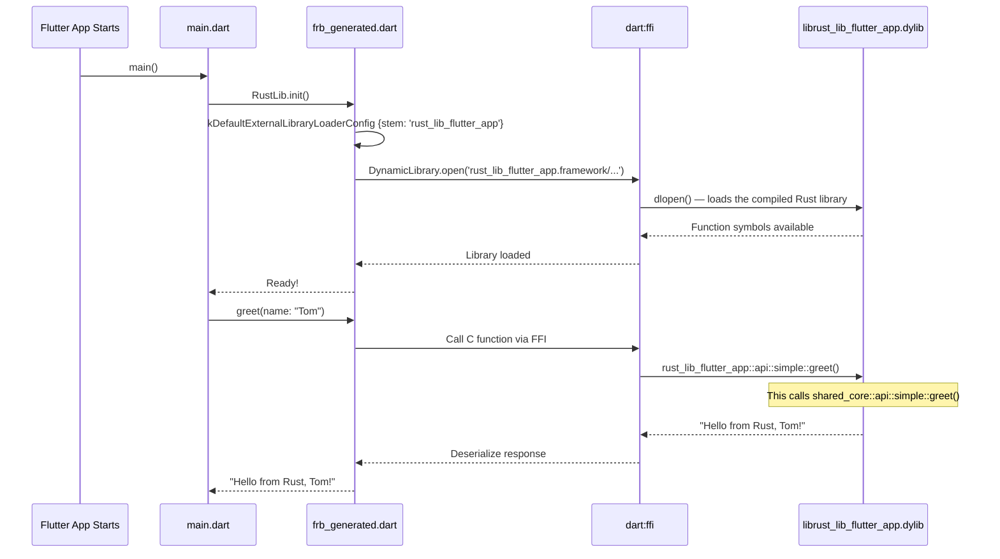

# Build Commands & Integration Guide

A practical reference for building, developing, and understanding the Rust ↔ Flutter integration in CrossPlatformIndexer.

---

## Table of Contents

1. [How Everything Connects](#how-everything-connects)
2. [The Three Rust Crates Explained](#the-three-rust-crates-explained)
3. [Build Commands](#build-commands)
4. [The Developer Workflow: Adding a New Function](#the-developer-workflow-adding-a-new-function)
5. [What Happens Under the Hood](#what-happens-under-the-hood)

---

## How Everything Connects

There are **5 components** that form a chain from your business logic to the Flutter UI:

```
┌─────────────────────────────────────────────────────────────────────────────┐
│                        YOUR CODE LIVES HERE                                │
│                                                                            │
│  ┌──────────────┐         ┌──────────────────┐        ┌────────────────┐   │
│  │ shared_core/  │────────▶│ rust/             │───────▶│ Dart generated │   │
│  │ Pure Rust SDK │  Cargo  │ FRB glue crate    │  FRB   │ lib/src/rust/  │   │
│  │              │  dep    │ #[frb] wrappers   │ codegen│                │   │
│  └──────────────┘         └──────────────────┘        └───────┬────────┘   │
│       ▲                          ▲                            │            │
│       │                          │                            ▼            │
│  You write                  You write thin              Auto-generated     │
│  business logic             1-line wrappers            Dart FFI bindings   │
│                                                               │            │
│                                                               ▼            │
│                    ┌──────────────────┐              ┌────────────────┐    │
│                    │ rust_builder/     │              │ Flutter App    │    │
│                    │ Flutter plugin    │─────────────▶│ lib/main.dart  │    │
│                    │ + Cargokit        │  Compiles &  │ UI calls Dart  │    │
│                    │ (DON'T TOUCH)     │  bundles     │ FFI bindings   │    │
│                    └──────────────────┘  the .dylib   └────────────────┘    │
│                                                                            │
└─────────────────────────────────────────────────────────────────────────────┘
```

### The Connection Chain

| From | To | Connected By | File That Creates the Link |
|------|----|-------------|--------------------------|
| `shared_core` → `rust/` | Cargo dependency | `rust/Cargo.toml` line: `shared_core = { path = "../../../shared_core" }` |
| `rust/` → `Dart bindings` | FRB codegen | `flutter_rust_bridge.yaml` line: `rust_root: rust/` |
| `rust_builder/` → Flutter build | Flutter plugin (Cargokit) | `rust_builder/pubspec.yaml` declares `ffiPlugin: true` for each platform |
| `rust_builder/` → `shared_core` | Cargo dependency | `rust_builder/Cargo.toml` line: `shared_core = { path = "../../../shared_core" }` |
| Flutter app → `rust_builder/` | Dart package dep | `pubspec.yaml` line: `rust_lib_flutter_app: path: rust_builder` |
| All crates → Workspace | Workspace members | Root `Cargo.toml` lists all three in `members = [...]` |

### Config Files Summary

```
CrossPlatformIndexer/
├── Cargo.toml                          # Workspace: lists shared_core, rust/, rust_builder/
└── apps/flutter_app/
    ├── pubspec.yaml                    # Flutter deps: includes rust_lib_flutter_app (rust_builder)
    ├── flutter_rust_bridge.yaml        # FRB config: rust_root → rust/, dart_output → lib/src/rust
    ├── rust/Cargo.toml                 # Glue crate: depends on shared_core + flutter_rust_bridge
    └── rust_builder/Cargo.toml         # Plugin crate: depends on shared_core + flutter_rust_bridge
```

---

## The Three Rust Crates Explained

### 1. `shared_core/` — The SDK (Your Brain)

```toml
# shared_core/Cargo.toml
[package]
name = "shared_core"
edition = "2024"

[lib]
crate-type = ["lib", "staticlib", "cdylib"]
# "lib"        → Rust-to-Rust dependency (used by rust/ and rust_builder/)
# "staticlib"  → Static C library (for iOS, Swift, etc.)
# "cdylib"     → Dynamic C library (for Python, server FFI, etc.)

[dependencies]
# NO flutter_rust_bridge here! This is pure Rust.
```

**Purpose**: All your business logic. Zero knowledge of Flutter or FFI.

**Example** (`shared_core/src/api/simple.rs`):
```rust
pub fn greet(name: String) -> String {
    format!("Hello from Rust, {}!", name)
}
```

**Rule**: Never add `flutter_rust_bridge` as a dependency here. If you do, `shared_core` becomes Flutter-specific and can't be used from a server, CLI, or WASM.

---

### 2. `apps/flutter_app/rust/` — The FRB Glue Crate (The Translator)

```toml
# rust/Cargo.toml
[package]
name = "rust_lib_flutter_app"

[lib]
crate-type = ["cdylib", "staticlib"]
# This compiles into the .dylib/.so/.framework that Cargokit bundles into the app

[dependencies]
flutter_rust_bridge = "=2.11.1"                # FRB for #[frb] annotations
shared_core = { path = "../../../shared_core" } # Your SDK
```

**Purpose**: Thin wrapper that imports `shared_core` functions and annotates them with `#[flutter_rust_bridge::frb]` so the codegen can create Dart bindings.

**Example** (`rust/src/api/simple.rs`):
```rust
#[flutter_rust_bridge::frb(sync)]
pub fn greet(name: String) -> String {
    shared_core::api::simple::greet(name) // Just delegates — no logic here
}
```

**What FRB codegen reads**: The `flutter_rust_bridge.yaml` tells it:
```yaml
rust_input: crate::api          # Read all pub functions in rust/src/api/**
rust_root: rust/                 # The Rust crate to expand
dart_output: lib/src/rust        # Where to write generated Dart files
```

**Key fact**: Cargokit compiles THIS crate (name = `rust_lib_flutter_app`) into the native library that gets bundled into the app. That's why the generated Dart code has `stem: 'rust_lib_flutter_app'`.

---

### 3. `apps/flutter_app/rust_builder/` — The Flutter Plugin (The Plumber)

```yaml
# rust_builder/pubspec.yaml
name: rust_lib_flutter_app
flutter:
  plugin:
    platforms:
      android: { ffiPlugin: true }
      ios:     { ffiPlugin: true }
      linux:   { ffiPlugin: true }
      macos:   { ffiPlugin: true }
      windows: { ffiPlugin: true }
```

**Purpose**: A Flutter plugin package whose ONLY job is to hook Cargokit into the Flutter build system. When Xcode/Gradle/CMake builds the Flutter app, Cargokit (embedded inside `rust_builder/cargokit/`) runs a Dart script that:

1. Detects the target platform (macOS, Android arm64, iOS, etc.)
2. Runs `cargo build --target <target>` on the `rust/` crate
3. Copies the resulting `.dylib` / `.so` / `.a` into the right place in the app bundle

**Rule**: **Never write business logic here.** Never edit files in `rust_builder/cargokit/`. This is build infrastructure.

**How Flutter finds it**: Your `pubspec.yaml` has:
```yaml
dependencies:
  rust_lib_flutter_app:
    path: rust_builder    # This pulls in the plugin
```

---

## Build Commands

### Prerequisites

```bash
# Ensure these are installed
rustc --version          # Need 1.85+ (for edition 2024)
flutter --version        # Need 3.x
cargo install flutter_rust_bridge_codegen --version 2.11.1
cargo install cargo-expand --version 1.0.118  # Required by FRB codegen
```

---

### Building the Core SDK (shared_core)

```bash
# From the project root: /Users/sudeepsharma/Documents/GitHub/CrossPlatformIndexer

# Build shared_core as a Rust library (for development/testing)
cargo build -p shared_core

# Build in release mode
cargo build -p shared_core --release

# Run shared_core tests
cargo test -p shared_core

# Build shared_core for a specific target (e.g., Android)
cargo build -p shared_core --target aarch64-linux-android

# Build the entire workspace (shared_core + rust/ + rust_builder)
cargo build
```

---

### Regenerating FRB Bindings (After Changing rust/src/api/)

```bash
# From: apps/flutter_app/
cd apps/flutter_app

# This reads rust/src/api/*.rs and generates:
#   - rust/src/frb_generated.rs          (Rust FFI glue)
#   - lib/src/rust/frb_generated.dart    (Dart FFI bindings)
#   - lib/src/rust/api/simple.dart       (Dart API you call from Flutter)
flutter_rust_bridge_codegen generate
```

> **When to run this**: Every time you add, remove, or change a function signature in `rust/src/api/*.rs`. You do NOT need to run this when you only change `shared_core/` internals (as long as the `rust/src/api/` wrapper signatures stay the same).

---

### Building the Flutter App for Each Platform

```bash
# From: apps/flutter_app/
cd apps/flutter_app

# Get Dart/Flutter dependencies first
flutter pub get

# ── macOS ──
flutter build macos                   # Release build
flutter run -d macos                  # Debug run

# ── iOS ──
flutter build ios                     # Release build
flutter run -d <ios-device-id>        # Debug run on connected device

# ── Android ──
flutter build apk                    # Release APK
flutter build appbundle              # Release AAB (for Play Store)
flutter run -d <android-device-id>   # Debug run

# ── Windows ──
flutter build windows                # Release build
flutter run -d windows               # Debug run

# ── List available devices ──
flutter devices
```

**What happens internally when you run `flutter build macos`**:
1. Flutter calls Xcode to build the macOS app
2. Xcode sees the `rust_lib_flutter_app` plugin
3. The plugin's build phase triggers Cargokit
4. Cargokit runs: `cargo build -p rust_lib_flutter_app --release --target aarch64-apple-darwin`
5. This compiles `rust/` which pulls in `shared_core` as a dependency
6. The resulting `librust_lib_flutter_app.dylib` is bundled into the `.app`
7. At runtime, Dart's `DynamicLibrary.open('rust_lib_flutter_app')` loads it

---

### Cleaning Builds

```bash
# Clean Rust build artifacts
cargo clean

# Clean Flutter build artifacts
cd apps/flutter_app && flutter clean

# Nuclear clean (both)
cargo clean && cd apps/flutter_app && flutter clean

# After a clean, you need to re-run:
flutter pub get
flutter_rust_bridge_codegen generate
```

---

## The Developer Workflow: Adding a New Function

Here's the exact step-by-step when you want to expose a new Rust function to Flutter.

### Step 1: Write the logic in `shared_core`

```rust
// shared_core/src/api/simple.rs  (or a new file like indexer.rs)
pub fn hash_file(path: String) -> Result<String, String> {
    let bytes = std::fs::read(&path).map_err(|e| e.to_string())?;
    Ok(format!("{:x}", blake3::hash(&bytes)))
}
```

```bash
# Test it in isolation
cargo test -p shared_core
```

### Step 2: Add a thin wrapper in `rust/src/api/`

```rust
// apps/flutter_app/rust/src/api/simple.rs
#[flutter_rust_bridge::frb]  // async by default
pub fn hash_file(path: String) -> Result<String, String> {
    shared_core::api::simple::hash_file(path)
}
```

If you created a new file (e.g., `indexer.rs`), register it in `rust/src/api/mod.rs`:
```rust
pub mod simple;
pub mod indexer;  // Add this
```

### Step 3: Regenerate Dart bindings

```bash
cd apps/flutter_app
flutter_rust_bridge_codegen generate
```

This creates/updates `lib/src/rust/api/simple.dart` with:
```dart
// AUTO-GENERATED — do not edit
Future<String> hashFile({required String path}) { ... }
```

### Step 4: Call from Flutter

```dart
import 'package:flutter_app/src/rust/api/simple.dart';

final hash = await hashFile(path: "/Users/me/doc.pdf");
print("BLAKE3: $hash");
```

### Step 5: Build and run

```bash
flutter run -d macos
```

### Summary of "what to run when"

| You changed... | Run these commands |
|---------------|-------------------|
| `shared_core/` internals only (no API change) | `flutter run` (auto-rebuilds Rust via Cargokit) |
| `rust/src/api/*.rs` (new/changed function) | `flutter_rust_bridge_codegen generate` → `flutter run` |
| `shared_core/Cargo.toml` (new dependency) | `flutter run` (Cargo resolves deps automatically) |
| `pubspec.yaml` (new Flutter dependency) | `flutter pub get` → `flutter run` |
| Everything is broken | `cargo clean && cd apps/flutter_app && flutter clean && flutter pub get && flutter_rust_bridge_codegen generate && flutter run` |

---

## What Happens Under the Hood

### The Complete Build Chain (macOS example)



### Runtime Loading Chain



### Key Concept: Static Linking

When Cargo builds `rust_lib_flutter_app` (the `rust/` crate), it **statically links** `shared_core` into the resulting `.dylib`. This means:

- There is only **ONE** native library file in the app bundle: `librust_lib_flutter_app.dylib`
- `shared_core` is compiled and embedded INSIDE it — no separate `shared_core.framework` exists
- Dart only loads `rust_lib_flutter_app` — that's why `stem: 'rust_lib_flutter_app'` in the generated code
- If you see `stem: 'shared_core'` in `frb_generated.dart`, **that's the bug** we fixed earlier

### Why Two Crates (rust/ AND rust_builder/)?

This is the most confusing part, so let's be very clear:

| Crate | Role | Who Uses It |
|-------|------|------------|
| `rust/` (rust_lib_flutter_app) | **The actual Rust code** that gets compiled into a native library. Contains FRB annotations, wraps shared_core. | **Cargokit** compiles it. **FRB codegen** reads it. |
| `rust_builder/` (also named rust_lib_flutter_app in pubspec) | **A Flutter plugin package** that integrates Cargokit into the Flutter build. It's essentially build glue. | **Flutter/pub** uses it as a plugin dependency. |

The reason they're separate:
- Flutter needs a **Dart plugin package** (with `pubspec.yaml`, `ios/`, `android/` directories) to hook into the native build system
- But the actual Rust compilation is done by **Cargo**, which needs a `Cargo.toml` crate
- These are two different build systems (Dart pub vs Cargo) → two separate packages

Think of it as: `rust_builder/` is the **envelope** (tells the mail system where to deliver), and `rust/` is the **letter** (the actual content).
